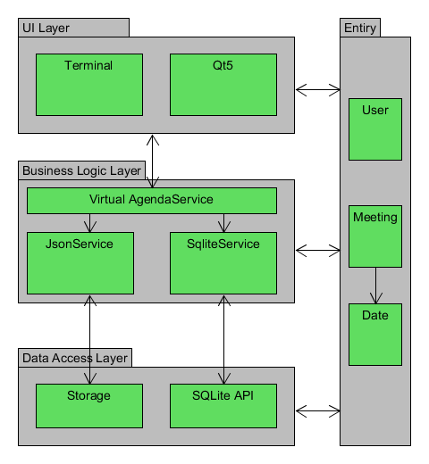
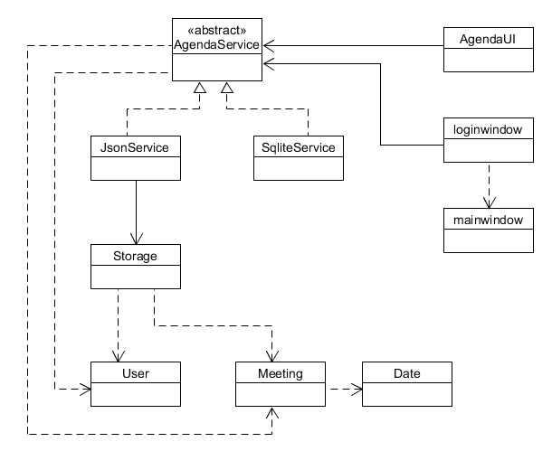

## IMPLEMENT CODES for SYSU SS TRNG 2014 - Agenda using Qt

A simple **C\+\+** project for practice, it contains most of the object oriented programming features, such as encapsulation, inheritance, polymorphism, etc. Besides, **SQLite3** and **Qt5** are added, which could help you learn basic database operations and desktop application development. Have Fun!!


### Features

Agenda is a simple app that can help you manage your daily life. It includes the following useful features:

- [x] User register, delete, login and logout
- [x] Storage selection: JSON / SQLite
- [x] List all users, meetings, sponsor meetings and participator meetings
- [x] Create meeting
- [x] Delete meeting by title, all meetings
- [x] Query meeting by title or by time interval
- [ ] Update meeting information
- [ ] Desktop notification

### Screenshots

**Terminal version Agenda**

     
     

**Qt5 version AgendaQt**

     
User sign in page

      
List all Meetings

     
Create a Meeting

### System Design

    
Three Tier Architecture 

    
System Class Diagram 

For more detail of project Agenda's design, Check out the **report** provided in `doc/Agenda_Report.pdf`.(*Sorry but it is Chinese only*)

### Install, Run and Uninstall

**Install**     
A 64bits debian package is provided in the project's [releases](https://github.com/chenyvehtung/Agenda/releases) page. Check it out and download newest package `agendaqt_x.x.x_amd64.deb`. Double click it or  `cd` to where it locates and run the folllowing command

```sh
sudo dpkg -i agendaqt*.deb
sudo apt -f install
```
**Run**     

* To run Qt version AgendaQt, type `AgendaQt` in terminal or find it in your system applications and click it.
* To run terminal version Agenda, type `Agenda` in terminal.

**Uninstall**    

To remove the application, run the following commands

```sh
sudo dpkg --purge agendaqt
rm -rf ~/.miniagenda  # to remove app data
```

### Build

**Setup Dependencies**    
This project is bulit with **sqlite3** and **Qt5**, so make sure you have set up the dependencies before trying to build it.     
For Ubuntu based system, you could use the following command to install sqlite3.

```sh
sudo apt install sqlite3 libsqlite3-dev
```

Check out Qt5's [Homepage](https://www.qt.io/developers/) to find out how to install it.     

**Make**     
If you are using [Qt Creator](https://www.qt.io/ide/), I strongly recommend you to import this project to it through file `Agenda.pro`, and then you should be able to build and run the project in it.     

If you want to build it in terminal, export your qt5 path to PATH and then use qmake. For example,

```sh
export PATH=/opt/Qt5.7.0/5.7/gcc_64/bin:$PATH
qmake Agenda.pro -r -spec linux-g++
make
```

### Debian Package

A debian package create script is provided in `mkpkg/mkpkg.sh`, [linuxdeployqt](https://github.com/probonopd/linuxdeployqt) is used in order to make the application self-contained.      
To build new package, you are supposed to compile Agenda and AgendaQt first, and then copy the binary files `Agenda` and `AgendaQt` to subfolder `mkpkg`, `cd` to `mkpkg/` and run the following commands.

```sh
bash mkpkg.sh
```

Wait for a few seconds, and you could see a package named `agendaqt_x.x.x_amd64.deb` in `mkpkg/`.

### Update History

* **May 24th, 2017:** Add sqlite3 back end in order to adopt [Polymorphism](https://en.wikipedia.org/wiki/Polymorphism_(computer_science)) and [Inheritance](https://en.wikipedia.org/wiki/Inheritance_(object-oriented_programming)) features to this project; Rearrange code structure; Fine tune UI.
* **Oct. 1st, 2016:** Add Qt5 front end, the original terminal based version was moved to subfolder `backend/`.
* **May 5th, 2016:** First commit.
